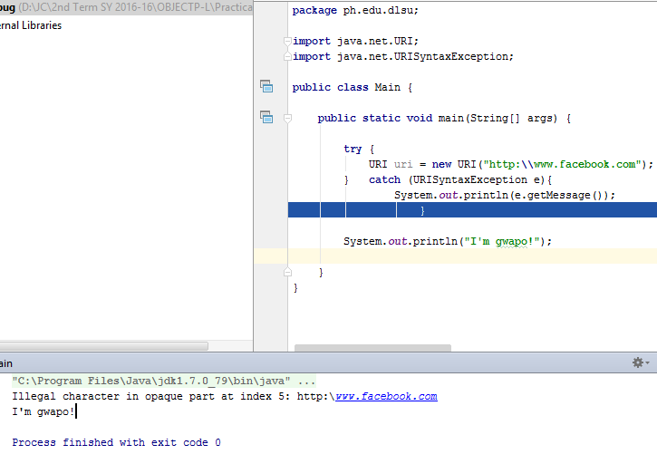

# Debugger.

~~~
package ph.edu.dlsu;

import java.net.URI;
import java.net.URISyntaxException;

public class Main {

    public static void main(String[] args) {

        try {
            URI uri = new URI("http:\\www.facebook.com");
        }   catch (URISyntaxException e){
                System.out.println(e.getMessage());
                    }

        System.out.println("I'm gwapo!");

    }
}
~~~
